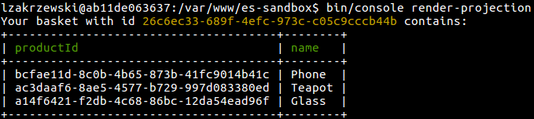

# Render projection - `CLI` entry point

```
bin/console render-projection
```

This `CLI` renders recorded events on [Basket](domain-model.md#aggregate) aggregate.

Arguments:
- `engine` (optional) engine of projection, this argument can be `event-store` or `mysql`. Default `event-store`
- `basketId` (optional) id of basket. Default is id of basket from latest simulation. It can be manually provided and it should be valid `uuid4` string. See [Online UUID Generator](https://www.uuidgenerator.net/),

## Projection engines
- `event-store` Projection is rendering basing on events recorded in `EventStore`
- `mysql` Projection is separate read model storied in `baskets` table. There is `MysqlBasketProjector` which applies to read model every event recorded on `Basket`. Switching between engines of projections allows to observe difference in performance.


## EventStore.UI
There is possibility to view/modify projection using `EventStore.UI` [http://127.0.0.1:2113/web/index.html#/projections](http://127.0.0.1:2113/web/index.html#/projections)
[Projections and Queries](http://docs.geteventstore.com/introduction/projections/)

## Example


## Query
```javascript
fromStream("stream-id")
    .when({
        $init: function(state, event) {
            return {
                basket: {
                    products: []
                }
            }
        },
        $any: function(state, event) {
            if (event.eventType == "ProductWasAddedToBasket") {
                return addProduct(event.body, state);
            }

            if (event.eventType == "ProductWasRemovedFromBasket") {
                return removeProduct(event.body.productId, state);
            }

            return state;
        }
    });

addProduct = function(product, state) {
    state.basket.products.push({
        name: product.name,
        productId: product.productId
    });

    return state;
}

removeProduct = function(productIdToRemove, state) {
    state.basket.products = function() {
        var idx,
            products = [];

        for (idx in state.basket.products) {
            if (state.basket.products[idx].productId !== productIdToRemove) {
                products.push(state.basket.products[idx]);
            }
        }

        return products;
    }();

    return state;
}
```